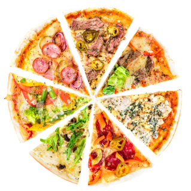

# Pizza App 🍕

<div align="center">

[](https://reactjs.org/)
[](https://www.typescriptlang.org/)
[](https://vitejs.dev/)
[](https://redux-toolkit.js.org/)
[](LICENSE)
[](CONTRIBUTING.md)

<p align="center">
  
</p>

A modern, responsive web application for ordering pizzas online. Built with React and TypeScript, featuring a clean UI and seamless user experience.

[Demo](https://the-best-pizza-app-ever.netlify.app/) • [Report Bug](../../issues) • [Request Feature](../../issues) • [Documentation](#documentation)

</div>

---

## ✨ Features

- 🔐 **User Authentication** - Secure login and registration system
- 🛒 **Shopping Cart** - Real-time cart updates with persistent storage
- 🎨 **Responsive Design** - Beautiful UI that works on all devices
- 🚀 **Fast Performance** - Built with Vite for optimal speed
- 🔒 **Protected Routes** - Secure access control
- 💾 **State Management** - Centralized Redux store with persistence

## 🚀 Live Demo

The application is deployed and accessible at:
https://the-best-pizza-app-ever.netlify.app/

### Demo Credentials

- Email: denis@gmail.com
- Password: 1234

You can also create your own account through the registration process.

## 🛠️ Technologies

- **Frontend Framework:** React 18
- **Language:** TypeScript
- **Build Tool:** Vite
- **State Management:** Redux Toolkit
- **Routing:** React Router DOM v6
- **HTTP Client:** Axios
- **Styling:** CSS Modules
- **Other Tools:**
  - classnames (for conditional class naming)
  - ESLint (code quality)
  - SWC (fast compilation)

## 📁 Project Structure

```
src/
├── components/         # Reusable UI components
├── helpers/           # Helper functions and utilities
├── interfaces/        # TypeScript interfaces
├── layout/           # Layout components
├── pages/            # Application pages/routes
├── store/            # Redux store configuration
└── assets/           # Static assets
```

## 🔑 Key Features

- User authentication (login/register)
- Product catalog browsing
- Shopping cart functionality
- Responsive design
- Protected routes
- State persistence

## � Prerequisites

Before you begin, ensure you have met the following requirements:

- Node.js >= 14.0.0
- npm >= 6.0.0
- Git

## 🚀 Installation and Setup

1. Clone the repository:

   ```bash
   git clone https://github.com/ProCodeZero/pizza-app.git
   cd pizza-app
   ```

2. Install dependencies:

   ```bash
   npm install
   ```

3. Create a `.env` file in the root directory with your environment variables:

   ```env
   VITE_API_URL=your_api_url_here
   ```

4. Start the development server:
   ```bash
   npm run dev
   ```

Your app should now be running on http://localhost:5173

## 🛠️ Development

### Available Scripts

- `npm run dev` - Start development server
- `npm run build` - Build for production
- `npm run lint` - Run ESLint
- `npm run preview` - Preview production build

## 🤝 Contributing

Contributions are what make the open source community such an amazing place to learn, inspire, and create. Any contributions you make are **greatly appreciated**.

1. Fork the Project
2. Create your Feature Branch (`git checkout -b feature/AmazingFeature`)
3. Commit your Changes (`git commit -m 'Add some AmazingFeature'`)
4. Push to the Branch (`git push origin feature/AmazingFeature`)
5. Open a Pull Request

## 📝 License

This project is licensed under the MIT License - see the [LICENSE](LICENSE) file for details.

## � Acknowledgments

- [React Documentation](https://react.dev/)
- [Redux Toolkit](https://redux-toolkit.js.org/)
- [Vite](https://vitejs.dev/)
- [TypeScript](https://www.typescriptlang.org/)

## 📞 Contact

Denis - [@your_twitter](https://twitter.com/your_twitter) - denis@example.com

Project Link: [https://github.com/ProCodeZero/pizza-app](https://github.com/ProCodeZero/pizza-app)
